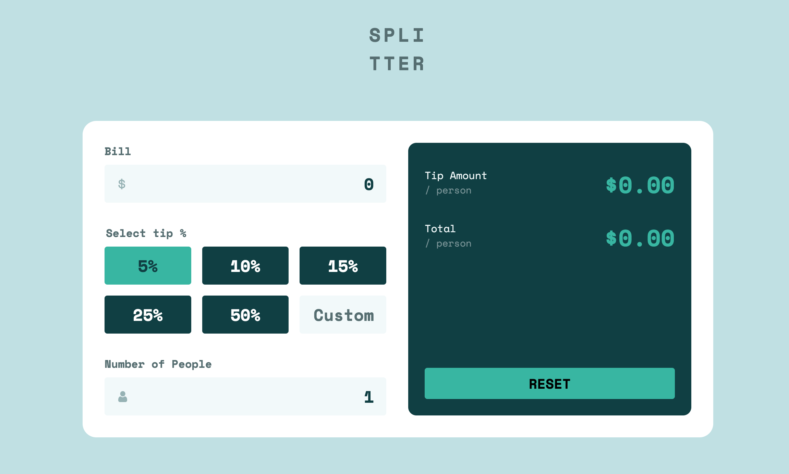

# Frontend Mentor - Tip calculator app solution

This is a solution to the [Tip calculator app challenge on Frontend Mentor](https://www.frontendmentor.io/challenges/tip-calculator-app-ugJNGbJUX). Frontend Mentor challenges help you improve your coding skills by building realistic projects.

## Table of contents

- [Overview](#overview)
  - [The challenge](#the-challenge)
  - [Screenshot](#screenshot)
  - [Links](#links)
- [My process](#my-process)
  - [Built with](#built-with)
  - [What I learned](#what-i-learned)

## Overview

### The challenge

Users should be able to:

- View the optimal layout for the app depending on their device's screen size
- See hover states for all interactive elements on the page
- Calculate the correct tip and total cost of the bill per person

### Screenshot

### Links

- Solution URL: [https://github.com/nerdynischal/tip-calculator-app-main](https://github.com/nerdynischal/tip-calculator-app-main)
- Live Site URL: [https://nerdynischal.github.io/tip-calculator-app-main/](https://nerdynischal.github.io/tip-calculator-app-main/)

## My process

### Built with

- Semantic HTML5 markup
- CSS custom properties
- Sass/SCSS
- Flexbox
- CSS Grid
- Mobile-first workflow
- JavaScript

### What I learned

I got to practice more with form elements and still got a long way to go but am more comfortable now than when I started. Also tried using BEM techniue for class names in CSS, which was a bit confusing at first but will hopefully get better with more practice and time.
